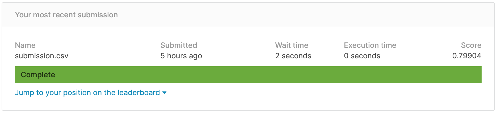
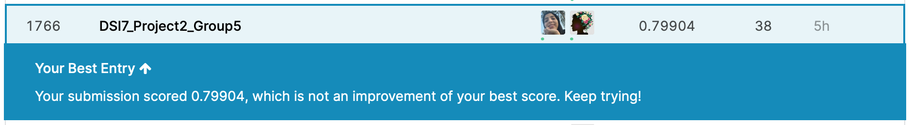

# Project 2: Kaggle Challenges with Titanic Survival (Classification)

This is project for Data Science Immersive course from General Assembly.

## Table of contents
* [Problem Statement](#Problem-Statement)
* [Datasets Description](#Datasets-Description)
* [Data Dictionary](#Data-Dictionary)
* [Conclusions](#Conclusions)
* [Reference](#Reference)
* [Group Members](#Group-Members)

## Problem Statement 

The sinking of the Titanic is one of the most infamous shipwrecks in history. On April 15, 1912, during her maiden voyage, the widely considered “unsinkable” RMS Titanic sank after colliding with an iceberg. Unfortunately, there weren’t enough lifeboats for everyone onboard, resulting in the death of 1502 out of 2224 passengers and crew. While there was some element of luck involved in surviving, it seems some groups of people were more likely to survive than others. We will use machine learning to create a predictive model that predicts which passengers survived the Titanic shipwreck using passenger data (ie name, age, gender, socio-economic class, etc).

## Datasets Description 

The data in this project has been split into two groups:

* training set (https://www.kaggle.com/c/titanic/data)
* test set (https://www.kaggle.com/c/titanic/data)

##  Data Dictionary 

The dataset's features listed bellow:

|Feature|Type|Dataset|Description|
|---|---|---|---|
|PassengerId|int|df|Passenger id|
|Survived|int|df|Survival as 0 = No, 1 = Yes|
|Pclass|int|df|Ticket class as 1 = 1st, 2 = 2nd, 3 = 3rd|
|Name|object|df|Name of the passenger|
|Sex|object|df|Sex / Gender|
|Age|float|df|Age in years|
|SibSp|int|df|Number of siblings / spouses aboard the Titanic|
|Parch|int|df|Number of parents / children aboard the Titanic|
|Ticket|object|df|Ticket number|
|Fare|float|df|Passenger fare|
|Cabin|object|df|Cabin number|
|Embarked|object|df|Port of Embarkation as C = Cherbourg, Q = Queenstown, S = Southampton|

## Conclusions 

As a second project in our Data Science Immersive Course with General Assembly and MiSK Academy, we were asked to finish this "Titanic Survival" Competition in Kaggle, We used multiple data cleaning methods, employed (EDA) methods to visualize the Data provided, in order to know the data well. Finally, we applied multiple machine learning methods in order to predict the the passengers survival in the test data set. The Classification models used were KNN, Decision Tree, Random Forest and a few more models. The best score we achieved in Kaggle competition, using a Random Forest Classifier with Accuracy = 0.79904. we, and were ranked as the 1769th out of 17,693 teams.

Thank you very much, Raghad, Fatmah, Hessah

* 
* 

## Reference 

The link bellow is for our Kaggle Challenge Titanic Survival
* [Kaggle Challenges for Titanic Survival](https://www.kaggle.com/raghadalharbi/kernel1fd22afc2e)

## Group Members 

* [Raghad Alharbi](https://www.kaggle.com/raghadalharbi)
* [Fatimah Aljohani](https://www.kaggle.com/fatmahaljohani)
* [Hessah Hamed Alkhattabi](https://www.kaggle.com/hessahalkhattabi)
